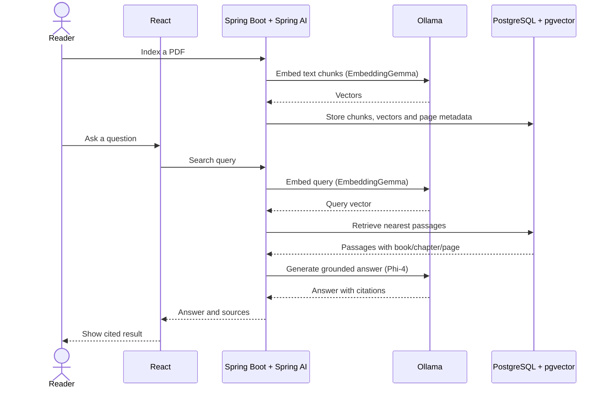

# Custom RAG

Find where software concepts are explained in your books. The app indexes PDF text and answers with book, chapter, page, and passage references.

## Requirements

- Docker Engine/Desktop with Compose v2, GNU Make, `curl`, and `jq`.
- Internet for the first build and model download (about 10 GB for Phi-4 and EmbeddingGemma; additional space for PDFs and the vector index).
- 16 GB RAM recommended. A GPU is optional; CPU inference works but is slower.

Java, Maven, Node.js, and Ollama do not need to be installed on the host.

## Run

```bash
make up
make models
```

Open [http://localhost:3000](http://localhost:3000), add PDFs under `data/books/`, then run:

```bash
make index-books
make search QUERY="Where are naming conventions explained?"
```

The PDFs stay local and are excluded from Git. Scanned/image-only PDFs need OCR. Local defaults are for development only; configure `.env` before exposing services beyond your machine.

`make down` stops the stack but preserves its database and model volumes.

## Flow


# custom-rag
