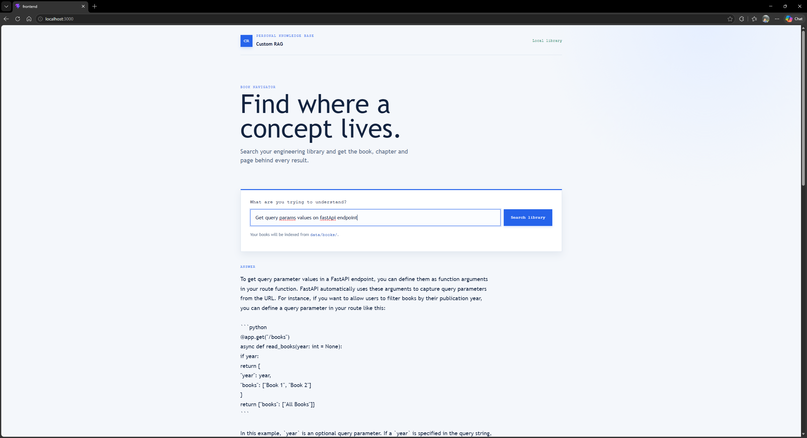

# Custom RAG

Find where software concepts are explained in your technical books, with book, chapter, and page references.

[Architecture overview](docs/architecture.md)



## Quick Start

Requires Docker Compose, GNU Make, `curl`, `jq`, and an internet connection for the initial image/model downloads.

Start the services:

```bash
docker compose up --build -d
```

Download the models into the persistent Ollama volume:

```bash
docker compose exec ollama ollama pull embeddinggemma:latest
docker compose exec ollama ollama pull phi4:latest
```

Copy PDFs to `data/books/` (subfolders are supported), open [http://localhost:3000](http://localhost:3000), select **Library**, and click **Scan library**. Progress and per-book status appear in the UI. You can then search from **Search**.

The PDFs stay local and are excluded from Git. Scanned/image-only PDFs need OCR. CPU inference works but may be slow.

CLI shortcuts are also available: `make up`, `make models`, `make index-books`, `make search QUERY="your question"`, and `make down`.
