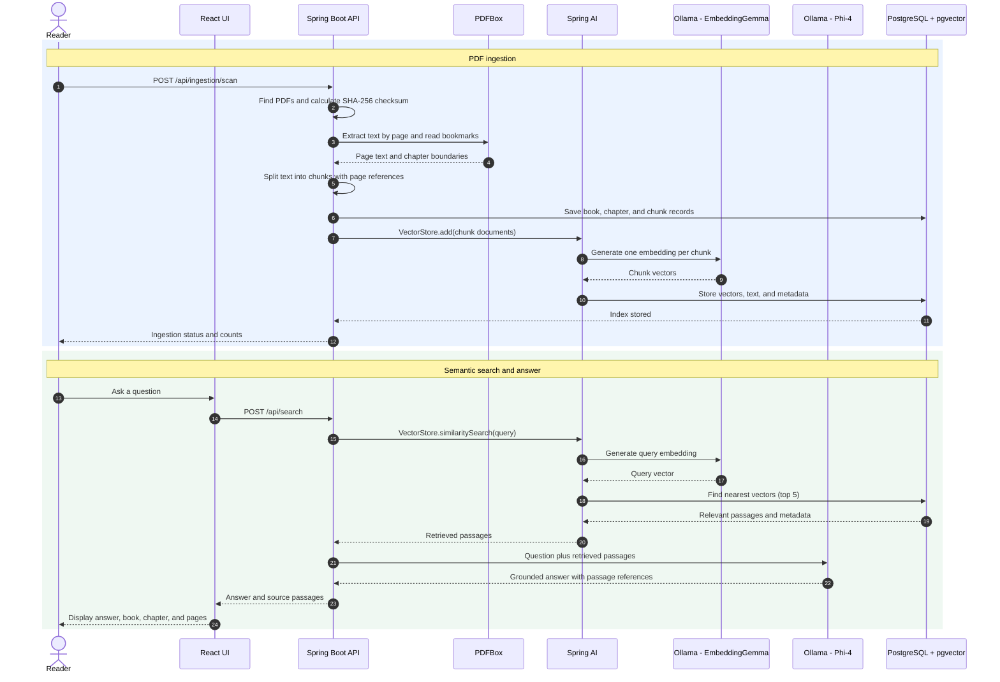

# Architecture

## 1. Introduction and Objectives

Custom RAG is a local-first application for finding software concepts in technical PDF books. It combines semantic retrieval with a language model so users can get a concise explanation and inspect the supporting book, chapter, and page references.

The current objectives are to:

- Ingest PDFs from `data/books/`, extracting text page by page and using PDF bookmarks as chapter boundaries when available.
- Split extracted text into overlapping chunks while retaining source metadata.
- Retrieve relevant passages by meaning rather than requiring exact keyword matches.
- Generate an answer grounded in retrieved passages and return the source passages separately for verification.
- Run the frontend, backend, database, and model server locally with Docker Compose. No external model API is required.

Scanned PDFs without an embedded text layer require OCR, which is not currently implemented. Chapter boundaries fall back to an unclassified range when bookmarks are unavailable.

## 2. Sequence Diagram

The language model does not query PostgreSQL itself. Spring AI performs retrieval first and passes the resulting passages to Phi-4 as context. The backend also returns the retrieved sources independently of the generated answer so the UI can display them for verification.

## 3. Storage Layer

### Vector database

PostgreSQL with the `pgvector` extension serves two roles: relational catalog storage and vector similarity search. Spring AI's `PgVectorStore` manages the `vector_store` table, including the chunk text, embedding vector, and JSON metadata. The configured embedding dimension is 768 and similarity uses cosine distance.

Each vector document carries metadata including `bookId`, `bookTitle`, `chapter`, `pageStart`, and `pageEnd`. During search, the question is embedded with the same EmbeddingGemma model used during ingestion; pgvector returns up to five similar passages subject to a similarity threshold.

### LLM providers

Ollama runs as a Docker Compose service, with model files persisted in the `ollama-data` volume. Spring AI connects to it at `http://ollama:11434`.

- **EmbeddingGemma** converts PDF chunks and search questions into 768-dimensional vectors. It is used for retrieval, not answer generation.
- **Phi-4** receives the question and retrieved passages, then writes a grounded response. It has no direct database access and is instructed to use only the supplied passages.

### Traditional storage

The original PDFs remain under `data/books/` on the host and are mounted read-only into the backend container. They are not copied into PostgreSQL and are excluded from Git.

Flyway-managed relational tables store the catalog and source text:

- `books`: title, optional author, source filename, SHA-256 checksum, indexing status, and creation time. The current ingestion flow derives the title from the filename; it does not yet extract the author.
- `chapters`: chapter number and title, page range, and a foreign key to the book.
- `book_chunks`: chunk text, ordinal, source page range, and foreign keys to the book and chapter.

The chunker uses a configurable maximum of 4,000 characters with 400 characters of overlap by default. PostgreSQL data and Ollama models persist in the `postgres-data` and `ollama-data` Docker volumes respectively.
